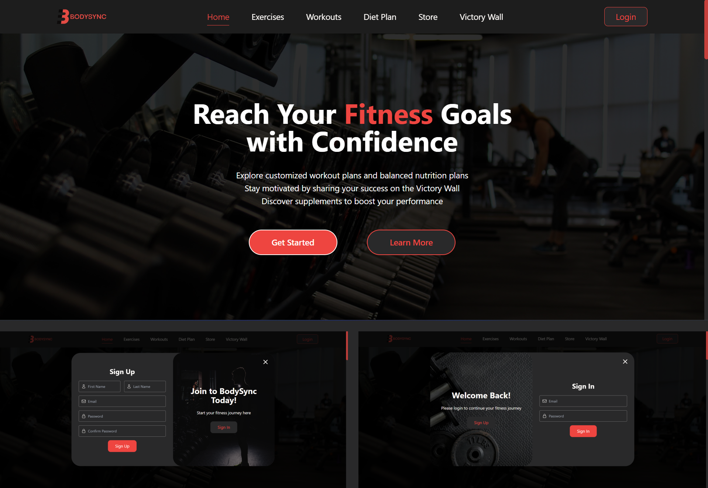

# BodySync - Personalized Fitness & Nutrition Planning System
A web-based fitness and nutrition planning system that provides users with personalized workout and diet plans, a virtual supplement store, and a Victory Wall to share success stories.<be><br>



---

## Features
### User
- User Registration & Login – Secure authentication for accessing the platform.
- Profile Management – Update personal details like weight, height, age and gender.
- Personalized Workout Plans – Automatically generate customized workout routines.
- Personalized Diet Plans – Receive tailored meal recommendations based on user data.
- Supplement Store – Browse and order supplements.
- Victory Wall – Share fitness progress and success stories with the community.
- Feedback System – Submit suggestions or report issues to improve the platform.

### Admin
- User Management – View, update, or remove user accounts.
- Exercise Management – Add, update, or delete exercises.
- Diet Plan Management – Manage food items and meal plans for user recommendations.
- Supplement Store Management – Add, edit, or remove products from the store and order management.
- Victory Wall Moderation – Filter or remove user-submitted stories.
- Feedback Review – Access user feedback for improvements.

---

## Tech Stack
- Frontend: React (Vite), Tailwind CSS
- Backend: Node.js, Express.js
- Database: MongoDB (Local)
- Tools: Postman (API testing), GitHub (Version control)

---

## Installation Guide  

Follow these steps to set up and run the **BodySync** project on your local machine.  

  1. Clone the Repository 
  Download the project from GitHub:
  ```sh  
  git clone https://github.com/geethaka11/BodySync.git
  cd BodySync
  ```
  2. Install backend dependencies
  ```sh  
  cd backend
  npm install
  ```
  3. Install frontend dependencies
  ```sh  
  cd ../frontend
  npm install
  ```
  4. Start the frontend
  ```sh  
  npm run dev
  ```
  5. Start the backend server
  ```sh  
  cd ../backend
  npm run dev
  ```

---

## Screenshots

### Admin Dashboard

<div>
  
  
</div>
<div>
  
  
</div>
<div>
  
  
</div>

### User Dashboard

<div>
  
  
</div>
<div>
  
  
</div>
