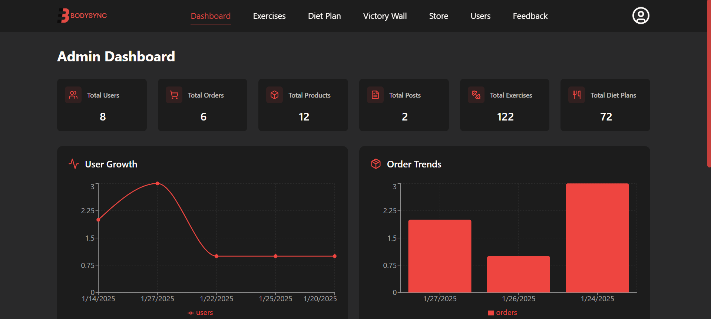
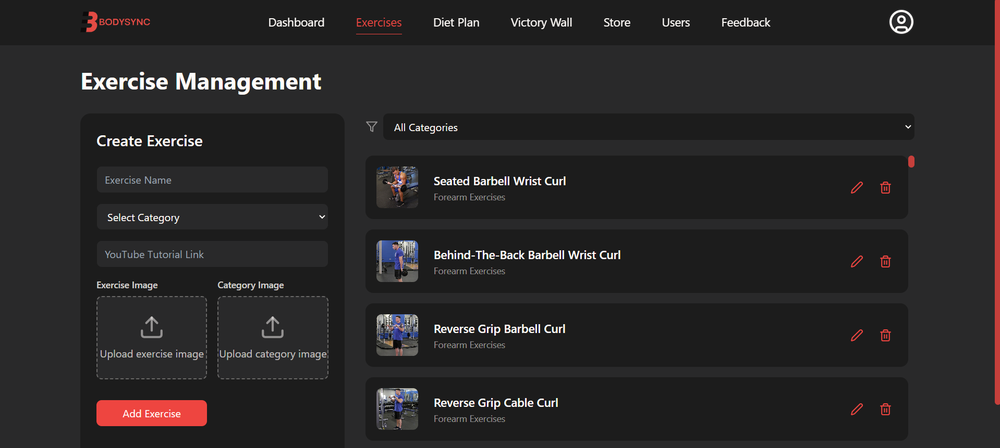
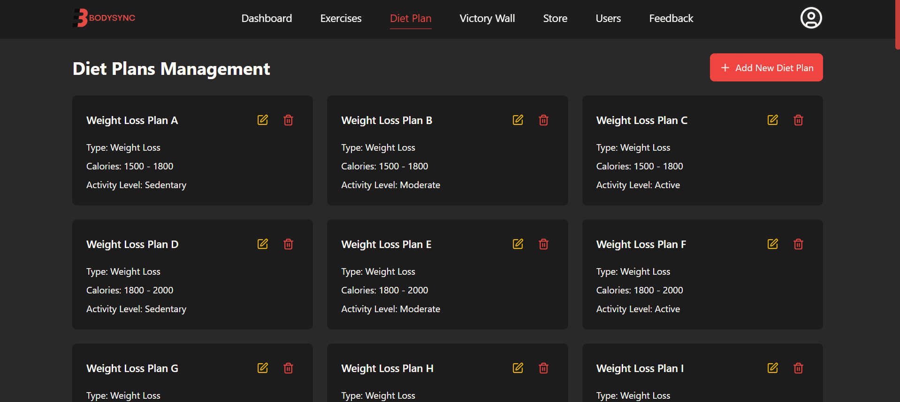
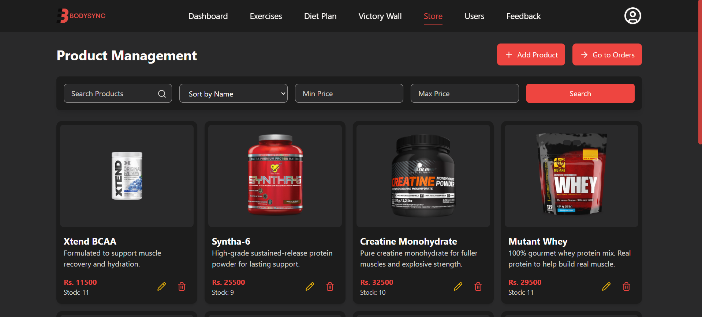
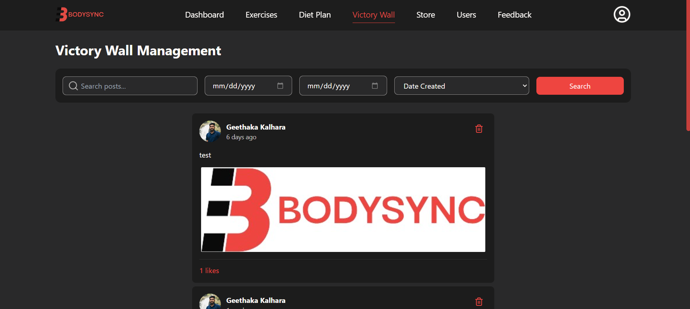
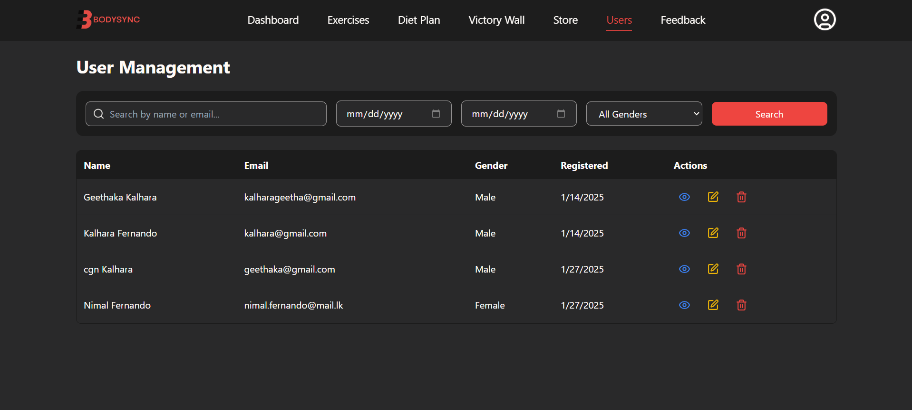
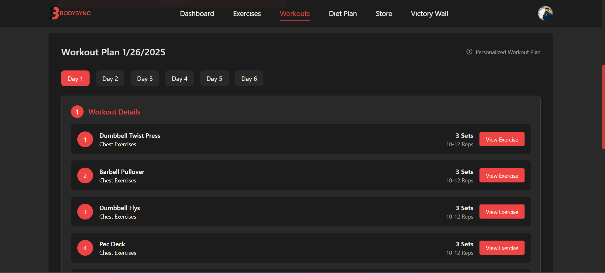
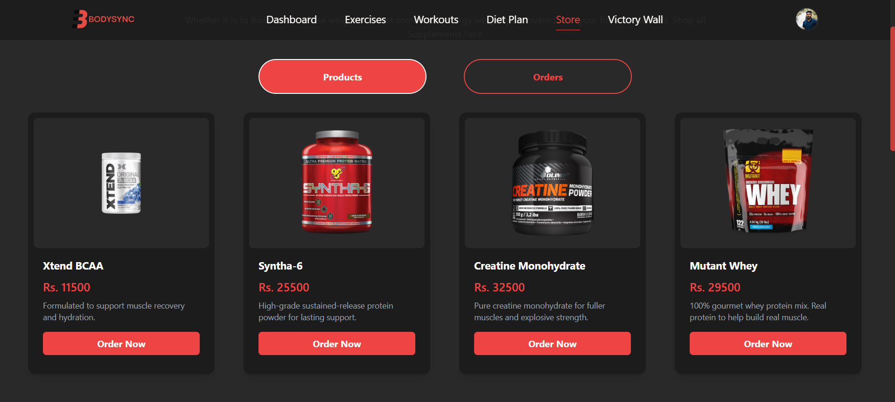
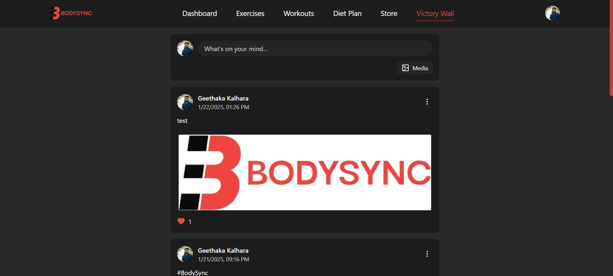

# Protein Lab - Personalized Fitness & Nutrition Planning System
A web-based fitness and nutrition planning system that provides users with personalized workout and diet plans, a virtual supplement store, and a Victory Wall to share success stories.<be><br>

## 🌐 Live Preview  
<div align="center">
<a href="https://Protein Lab.vercel.app/" target="_blank">Visit Protein Lab</a>
</div>
<br>
<div align="center">
<table>
  <thead>
    <tr>
      <th align="center">User Account</th>
      <th align="center">Admin Account</th>
    </tr>
  </thead>
  <tbody>
    <tr>
      <td>Email: <code>user@Protein Lab.com</code></td>
      <td>Email: <code>admin@Protein Lab.com</code></td>
    </tr>
    <tr>
      <td>Password: <code>user123</code></td>
      <td>Password: <code>admin123</code></td>
    </tr>
    <tr>
      <td>User URL: <a href="https://Protein Lab.vercel.app/">User homepage</a></td>
      <td>Admin URL: <a href="https://Protein Lab.vercel.app/admin/login/">Admin login</a></td>
    </tr>
  </tbody>
</table>
</div>


---

## Features
### User
- User Registration & Login – Secure authentication for accessing the platform.
- Profile Management – Update personal details like weight, height, age and gender.
- Personalized Workout Plans – Automatically generate customized workout routines.
- Personalized Diet Plans – Receive tailored meal recommendations based on user data.
- Supplement Store – Browse and order supplements.
- Victory Wall – Share fitness progress and success stories with the community.
- Feedback System – Submit suggestions or report issues to improve the platform.

### Admin
- User Management – View, update, or remove user accounts.
- Exercise Management – Add, update, or delete exercises.
- Diet Plan Management – Manage food items and meal plans for user recommendations.
- Supplement Store Management – Add, edit, or remove products from the store and order management.
- Victory Wall Moderation – Filter or remove user-submitted stories.
- Feedback Review – Access user feedback for improvements.

---

## Tech Stack
- Frontend: React (Vite), Tailwind CSS
- Backend: Node.js, Express.js
- Database: MongoDB
- Tools: Postman (API testing), GitHub (Version control)

---

## Installation Guide  

Follow these steps to set up and run the **Protein Lab** project on your local machine.  

  1. Clone the Repository 
  Download the project from GitHub:
  ```sh  
  git clone https://github.com/geethaka11/Protein Lab.git
  cd Protein Lab
  ```
  2. Install backend dependencies
  ```sh  
  cd backend
  npm install
  ```
  3. Install frontend dependencies
  ```sh  
  cd ../frontend
  npm install
  ```
  4. Start the frontend
  ```sh  
  npm run dev
  ```
  5. Start the backend server
  ```sh  
  cd ../backend
  npm run dev
  ```

### Backend Environment Variables

Create a `.env` file inside the `backend/` directory (you can copy from `env.example`) and provide the following values:

| Variable | Description |
| --- | --- |
| `PORT` | Backend port (default `5000`) |
| `MONGO_URI` | MongoDB connection string |
| `JWT_SECRET` | Secret used to sign JWT tokens |
| `USE_CLOUDINARY` | Set to `true` in production to upload files to Cloudinary (optional for local dev) |
| `CLOUDINARY_CLOUD_NAME` | Your Cloudinary cloud name |
| `CLOUDINARY_API_KEY` | Cloudinary API key |
| `CLOUDINARY_API_SECRET` | Cloudinary API secret |

On Render, add these variables in the service settings and set `USE_CLOUDINARY=true` so uploads go directly to Cloudinary.

### Migrating existing uploads to Cloudinary

1. Make sure the Cloudinary environment variables are configured and `USE_CLOUDINARY=true`.
2. From the `backend/` directory run:
   ```sh
   node scripts/migrate-uploads-to-cloudinary.js
   ```
   This uploads every file under `backend/uploads/**` to Cloudinary and updates MongoDB references.
3. Review the script output for any skipped files, then spot-check the UI/endpoints (photos, products, exercises, posts, profiles).
4. After confirming everything loads from Cloudinary, you can safely delete the contents of `backend/uploads/` to free space.

### Testing uploads locally vs production

| Scenario | Steps |
| --- | --- |
| Local development (disk storage) | Leave `USE_CLOUDINARY=false`, run `npm run dev` in both `frontend/` and `backend/`. Files are stored under `backend/uploads/**` and served from `http://localhost:5000/uploads/...`. |
| Production / Render | Set `USE_CLOUDINARY=true` plus the Cloudinary credentials, rebuild the Docker images, and deploy. All uploads go directly to Cloudinary and are served from CDN URLs. |
| Smoke test after deploy | Use the admin UI to upload a photo/product/profile, confirm the response payload contains a Cloudinary URL, and ensure the public pages render the new asset correctly. |

### Rebuilding and deploying Docker images

```sh
# Backend
cd backend
docker build -t mahdi157/protienlab-backend:latest .
docker push mahdi157/protienlab-backend:latest

# Frontend
cd ../frontend
docker build --build-arg VITE_API_URL=https://protienlab-backend.onrender.com -t mahdi157/protienlab-frontend:latest .
docker push mahdi157/protienlab-frontend:latest
```

After pushing, trigger a manual deploy for both services in the Render dashboard so the new images (with Cloudinary support) go live.

---

## Screenshots

### Admin

<div>
  
  
</div>
<div>
  
  
</div>
<div>
  
  
</div>

### User

<div>
  
  
</div>
<div>
  
  
</div>

## 🔗 Project Link  
[Visit Protein Lab](https://Protein Lab.vercel.app/)
